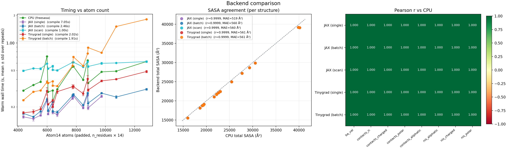

# protein-affinity-gpu

`protein-affinity-gpu` started as an entry for the
[Adaptyv](https://www.adaptyvbio.com/) binder-design competition. I wanted
to add a loss to AFDesign's hallucination loop —
specifically **buried surface area (BSA)** — which required writing the
Shrake–Rupley SASA algorithm in JAX, end-to-end differentiable. Once the
BSA path worked, the same masking + contact logic scores PRODIGY's IC-NIS
ΔG, so I wired that up too. (It took longer than expected)

At inference the JAX and tinygrad paths reproduce the CPU reference
(freesasa via PRODIGY) to within ≈ 0.05 kcal/mol on 1A2K and hit equal or
better wall-clock once the JIT is warm (<1s per structure), tracked in the
benchmark panels below. The tinygrad backend also runs on Apple M-series
chips via Metal (`TINYGRAD_DEVICE=METAL`) — no CUDA / Modal needed for
local iteration.

What's next is using the
whole pipeline as a **filter on generated bindres designs**  (Still in development).

## Installation

The package is currently installed from source. Clone the repo and sync
with [uv](https://docs.astral.sh/uv/) for a reproducible environment
pinned against `uv.lock`:

```bash
uv sync                # core deps into .venv/, honouring uv.lock
uv sync --extra modal  # adds modal for the GPU benchmark entrypoint
```

The core deps already cover CPU (`prodigy-prot`, `freesasa`), JAX (`jax`,
`jaxlib`), tinygrad, and the plot stack (`matplotlib`, `pandas`).
`pyproject.toml` declares unpinned ranges, `uv.lock` is the exact pinned
resolution, and `.venv/` is a local (gitignored) virtualenv `uv`
materialises from the lock.

## CLI

The package installs one console script — `protein-affinity-predict`.
It runs one structure or a whole folder through any backend:

```bash
protein-affinity-predict benchmarks/fixtures --backend cpu --output-json
protein-affinity-predict benchmarks/fixtures --backend jax --output-json
protein-affinity-predict benchmarks/fixtures --backend tinygrad --output-json
```

| Flag | Default | Description |
|------|---------|-------------|
| `input_path` | — | File or directory of `.pdb` / `.ent` / `.cif` / `.mmcif`. |
| `--backend {cpu,jax,tinygrad}` | `cpu` | Prediction backend. |
| `--selection` | `A,B` | Comma-separated two-chain selection. |
| `--temperature` | `25.0` | Temperature in °C (affects Kd). |
| `--distance-cutoff` | `5.5` | Å cutoff for interface contacts. |
| `--acc-threshold` | `0.05` | Relative SASA threshold for NIS. |
| `--sphere-points` | `100` | Shrake–Rupley sphere resolution. |
| `--output-json` | off | Also write `<stem>_results.json` per structure. |
| `--output-dir` | `results/` | Destination when `--output-json` is set. |
| `--verbose` | off | `DEBUG`-level logging with per-phase timings (stderr, colored on TTY). |

Each run prints the same summary `str(result)` produces — ΔG, Kd,
contact breakdown, NIS breakdown. `--output-json` persists the full
per-atom result; `--verbose` streams phase timings to stderr.


## Python API

```python
from pathlib import Path

from protein_affinity_gpu import (
    load_complex,
    predict,
    predict_binding_affinity,
    predict_binding_affinity_jax,
)

structure = Path("benchmarks/fixtures/1A2K.pdb")
target, binder = load_complex(structure, selection="A,B")

# Default backend-specific entry points:
cpu_result = predict_binding_affinity(structure, selection="A,B")
jax_result = predict_binding_affinity_jax(structure, selection="A,B")                # mode="block"
jax_scan   = predict_binding_affinity_jax(structure, selection="A,B", mode="scan")

# Or route through the unified predictor:
result = predict(structure, backend="jax", selection="A,B")

# Stable differentiable helpers for design-time losses:
from protein_affinity_gpu.af_design import add_ba_val_loss
from protein_affinity_gpu.sasa_soft import calculate_sasa_batch_scan_soft

# Experimental (tinygrad / single / neighbor entry points) — see docs/EXPERIMENTAL.md:
from protein_affinity_gpu.experimental import predict_binding_affinity_tinygrad
tg_result = predict_binding_affinity_tinygrad(structure, selection="A,B")
```

The public surface exported from `protein_affinity_gpu.__init__` is:
`__version__`, `ContactAnalysis`, `Protein`, `ProdigyResults`,
`load_complex`, `load_structure`, `predict`, `predict_binding_affinity`,
`predict_binding_affinity_jax`.

## Result

Every backend returns the same `ProdigyResults` dataclass. Call
`result.to_dict()` (or `result.save_results(output_dir)`) to get a
stable JSON-serialisable view — the CLI writes exactly this shape when
given `--output-json`:

| Field | Meaning |
|-------|---------|
| `ba_val` | Predicted ΔG of binding in kcal/mol (PRODIGY IC-NIS). |
| `kd` | Dissociation constant in molar units — `dg_to_kd(ba_val, temperature)`. |
| `contacts` | Interface residue–residue contact counts by **A**liphatic / **C**harged / **P**olar pair (`AA`, `CC`, `PP`, `AC`, `AP`, `CP`), plus derived totals (`IC`, `chargedC`, `polarC`, `aliphaticC`). |
| `nis` | Percentage of the non-interacting surface per character class. |
| `sasa_data` | Per-atom SASA after the NIS mask, with chain / residue / atom metadata. |

```json
{
  "structure_id": "1A2K",
  "ba_val": -9.42,
  "kd": 1.23e-07,
  "contacts": {"AA": 12, "CC": 3, "PP": 5, "AC": 4, "AP": 6, "CP": 2,
               "IC": 32, "chargedC": 9, "polarC": 13, "aliphaticC": 22},
  "nis": {"aliphatic": 41.2, "charged": 24.1, "polar": 34.7},
  "sasa_data": [{"chain": "A", "resname": "ALA", "resindex": 1,
                 "atomname": "CA", "atom_sasa": 12.5, "relative_sasa": 0.83}]
}
```

## Backends and Devices

| Backend | Entry point | Device selection |
|---------|-------------|------------------|
| CPU (PRODIGY / freesasa) | `predict_binding_affinity` | n/a |
| JAX — `mode="block"`/`"scan"`/`"single"` | `predict_binding_affinity_jax` | `JAX_PLATFORMS=cpu`/`cuda` |
| tinygrad — `mode="block"`/`"single"`/`"neighbor"` | `predict_binding_affinity_tinygrad` | `TINYGRAD_DEVICE=CPU`/`METAL`/`CUDA` |

All three backends share one pipeline parametrised by a
`BackendAdapter` that owns device resolution, lazy constant
materialisation, kernel dispatch, and the block-size heuristic. The
`mode` kwarg picks the SASA kernel family — `block` (bounded scratch,
per-shape JIT cache; default), `scan` (JAX-only, `lax.scan`-fused),
`single` (fully fused `[N, M, N]`; fastest when it fits). (and `neighbor`
(tinygrad-only, `topk`-pruned; for memory-constrained GPUs) - not working yet)

Atom layout note: structures enter the SASA kernel in **atom14**, the
AlphaFold2-style compact layout where each residue is packed into 14
slots (Trp's max) instead of atom37's 37 universal-index slots. Residue
meaning varies by column in atom14 but the tensor is ~4.4× smaller, and
padding slots carry zero radii so the kernel sees them as inert — a
`restype_atom14_to_atom37` gather scatters per-atom SASA back to atom37
for reporting (see [`utils/atom14.py`](src/protein_affinity_gpu/utils/atom14.py)).


See [docs/INDEX.md](docs/INDEX.md) for the full adapter / per-device
behaviour tables, block-size heuristics, kernel scratch shapes, and the
tinygrad `mode` trade-offs; [docs/EXPERIMENTAL.md](docs/EXPERIMENTAL.md)
and [docs/TINYGRAD_SASA_OPTIMIZATION.md](docs/TINYGRAD_SASA_OPTIMIZATION.md)
go deeper on the kernel-level choices.


## Benchmark

On the Kahraman 2013 T3 set (16 two-chain complexes, atom14-padded
N ∈ [4.4k, 12.8k]) the tinygrad block kernel runs at ~0.69 s warm-mean
vs ~0.44 s for CPU freesasa — within ~1.6× of CPU — with Pearson
`r > 0.9998` against CPU on per-structure SASA totals and `r = 1.000`
on ΔG, Kd, NIS and contact metrics.

To make CPU and GPU rows directly comparable, all four backends run
**Shrake–Rupley with 100 sphere points** and the same NACCESS vdW radii
from [`data/vdw.radii`](src/protein_affinity_gpu/data/vdw.radii); 100 is
well below the 960 used in the original Shrake–Rupley reference but our
tinygrad 100-vs-960 sanity check on 1A2K and 2CFH shows total SASA
shifts by ≤ 0.55 % (per-atom MAE ≈ 0.5 Ų, max |Δ| ≈ 4.7 Ų) and
predicted ΔG by ≤ 0.11 kcal/mol — no meaningful degradation at 100 for
the PRODIGY scoring function. Sphere points are laid out with a
**golden-spiral (Fibonacci)** scheme in
[`sasa.generate_sphere_points`](src/protein_affinity_gpu/sasa.py);
a **Thomson-sphere** layout (electrostatic-equilibrium, exactly uniform)
would matter more for integrations where each point's implicit weight
feeds a quantity like *contact area* — not used here, flagged as the
alternative if that ever becomes relevant.

The comparison figure below is committed at
[`docs/assets/comparison_figure.png`](docs/assets/comparison_figure.png).
It is the merged output of one local Apple M1 Max run and one Modal A100-80GB
run, plotted with `benchmarks/plot_results.py` (which writes into the
gitignored `benchmarks/output/combined/` and is copied into
`docs/assets/` for the README).



### What was compared

Eight backend×device combinations over the 16-complex Kahraman 2013 T3
manifest
([`benchmarks/datasets/kahraman_2013_t3.tsv`](benchmarks/datasets/kahraman_2013_t3.tsv)),
atom14-padded N ∈ [4.4k, 12.8k] atoms. `Warm` is per-structure warm-mean,
`atoms/s` is `Σ N / Σ t`, `α` is the log–log slope of `t` vs `N`
(`t ∝ Nᵅ`), `Cold` is first-call compile + run per structure:

| Backend | Device | Kernel | Warm | atoms/s | α | Cold |
|---------|--------|--------|-----:|--------:|--:|-----:|
| `cpu` | M1 Max CPU | freesasa Shrake–Rupley, 100 points, real atoms | 0.44 s | ~17 k | ~0.6 | 0.4 s |
| `tinygrad-single` | M1 Max Metal | fully fused `[N, M, N]` | 0.64 s | ~12 k | ~1.6 | 1.0 s |
| `tinygrad-batch` (block) | M1 Max Metal | per-shape `TinyJit`, `block = min(768, N)` | 0.70 s | ~11 k | ~1.8 | 0.9 s |
| `jax-single` † | A100-80GB | fully fused single-pass `[N, M, N]` | 0.20 s | ~34 k | ~0.7 | 7.0 s |
| `jax-batch` (block) | A100-80GB | blocked SR, Python loop over `@jit`ed kernel | 0.23 s | ~34 k | ~0.6 | 2.7 s |
| `jax-scan` | A100-80GB | `lax.scan`-fused block loop | 0.56 s | ~13 k | ~0.2 | 1.0 s |
| `tinygrad-single` | A100-80GB | fully fused `[N, M, N]` | 0.29 s | ~26 k | ~1.0 | 2.0 s |
| `tinygrad-batch` (block) | A100-80GB | `TinyJit` per `(B, N, M)` | 0.64 s | ~12 k | ~2.0 | 2.0 s |

† `jax-single` excludes 1HE8 (N=12810) and 1Y64 (N=10738) — both OOM on
80 GB at the ~66 / ~46 GB fused scratch.

- **`jax-scan` cold is ~3× faster than `jax-batch`** because the block
  loop is hoisted into one `lax.scan` XLA primitive — one small while-body
  to compile, no tail-block re-compile. `jax-single`'s 7 s cold is the
  same kernel but one giant HLO per distinct `N`.
- **Scaling patterns**: A100 JAX is overhead-bound (`α ≈ 0.2–0.7`);
  `tinygrad-batch` is near-quadratic (per-block Python dispatch doesn't
  amortize); CPU is sub-linear (freesasa's C Shrake–Rupley uses an
  internal neighbour/cell list so per-atom work is ~constant).
- **CPU vs GPU parity**: all backends run Shrake–Rupley at 100 sphere
  points (see `cpu.py:35-36`); the CPU row differs only in working on the
  real, un-padded atom set (~1.7× fewer atoms than the atom14-padded GPU
  tensors) and in freesasa's C neighbour-list implementation vs the GPU's
  dense `[N, M, N]` probe-scatter. Same algorithm, same integration
  density — agreement is `r = 0.9999` on SASA and `r = 1.000` on
  ΔG/Kd/NIS.

### Commands

```bash
# Local M1 Max: cpu + tinygrad-batch + tinygrad-single
.venv/bin/python benchmarks/benchmark.py \
    --manifest benchmarks/datasets/kahraman_2013_t3.tsv \
    --structures-dir benchmarks/downloads/kahraman_2013_t3 \
    --output-dir benchmarks/output/local \
    --targets cpu tinygrad-batch tinygrad-single

# Remote A100-80GB: jax-single,batch,scan + tinygrad-single,batch
modal run benchmarks/modal_benchmark.py \
    --repeats 2 --run-name kahraman-a100 \
    --targets jax-single,jax-batch,jax-scan,tinygrad-single,tinygrad-batch \
    --local-output-dir benchmarks/output/gpu

# Merge the two CSVs into one figure (earlier CSVs win on shared columns —
# passing the GPU file first keeps A100 numbers and fills only CPU-only
# columns from the local run).
.venv/bin/python benchmarks/plot_results.py \
    benchmarks/output/gpu/results.csv \
    benchmarks/output/local/results.csv \
    --output-dir benchmarks/output/combined \
    --figure-name comparison_figure.png
```

### Observed differences and why

- **All 6 GPU backends agree with CPU to Pearson `r = 0.9999`** on
  per-structure SASA totals once TF32 is disabled. Without the fix, JAX
  on A100 drifts per-structure because the Shrake–Rupley kernels use the
  `dist² = ‖a‖² + ‖b‖² − 2·⟨a,b⟩` identity — a classic catastrophic
  cancellation trap. TF32's ~10-bit mantissa in `@`/`einsum` flips
  buried/not-buried sphere-point votes near the threshold. We set
  `JAX_DEFAULT_MATMUL_PRECISION=highest` in the Modal image
  ([`benchmarks/modal_benchmark.py`](benchmarks/modal_benchmark.py))
  and as a module-level `jax.config.update(...)` in
  [`src/protein_affinity_gpu/af_design.py`](src/protein_affinity_gpu/af_design.py)
  so the design loss inherits it locally too. Tinygrad-Metal has no TF32
  path and was already correct.

- **JAX compile caches accumulate across distinct shapes** and pin device
  scratch, so a 16-structure sweep can OOM on 80 GB even when each
  individual structure fits. The sweep loop calls
  `clear_accelerator_caches()` (in
  [`benchmarks/sasa/sasa_benchmark.py`](benchmarks/sasa/sasa_benchmark.py)),
  which runs `jax.clear_caches()` + tinygrad `TinyJit` cache drops
  + `gc.collect()` between structures.

- **Two largest structures still OOM `jax-single`** (N = 12810 and
  N = 10738 → fused scratch of 66 GB / 46 GB). That is a physics limit of
  the fused kernel, not a cache issue — use `jax-block` or `jax-scan` for
  those.

### Setup

```bash
uv sync --extra modal
modal setup
```
---
### SASA Algorithm — Shrake–Rupley vs Lee–Richards

All three backends implement the **Shrake–Rupley** rolling-probe algorithm
(1973). For each atom, a fixed set of points is distributed on the
expanded van der Waals sphere (radius `r_atom + r_probe`, `r_probe = 1.4 Å`
by default); each point is tested against every neighbouring atom, and
the accessible area is the fraction of non-occluded points times the
sphere area. The CPU path delegates to
[freesasa](https://freesasa.github.io/) through PRODIGY; the JAX and
tinygrad paths reimplement the same algorithm as a vectorised kernel
over an `[N_atoms, N_sphere_points]` tensor so it runs on GPU.

The classical alternative is **Lee–Richards** (1971), which computes the
exact accessible surface analytically by constructing and clipping arcs
where the rolling-probe sphere slides across neighbour contacts. For a
given probe radius the Lee–Richards answer is mathematically exact (no
sphere-point discretisation error), whereas Shrake–Rupley error scales
as ~`1/sqrt(N_sphere_points)`. We use Shrake–Rupley anyway because it is
embarrassingly parallel — the entire computation reduces to elementwise
distance ops, an occlusion comparison, and a sum over the sphere-point
axis — which maps cleanly onto `jnp.einsum` / tinygrad `Tensor` ops and
onto the blocked and fused kernels documented above. Lee–Richards
requires per-atom branching, 2D arc bookkeeping, and neighbour-graph
traversal, none of which vectorise well on GPU. At the default
`--sphere-points 100` the Shrake–Rupley estimate is already within
Pearson `r = 0.9999` of freesasa's own Shrake–Rupley reference and
downstream PRODIGY metrics (ΔG, Kd, NIS, contact classes) match to
`r = 1.000`, so the integration error is well below the noise floor of
the scoring function.

### Van der Waals Radii

SASA computation uses a NACCESS-style van der Waals radii library
shipped at [`src/protein_affinity_gpu/data/vdw.radii`](src/protein_affinity_gpu/data/vdw.radii)
and loaded by `protein_affinity_gpu.utils.residue_library`. The file is a
plain text per-atom table — per-residue `ATOM <name> <radius> <polar>`
lines — that can be swapped for any NACCESS-formatted library (e.g. a
Bondi set, or a user-patched radius for a non-standard residue) by
editing the file in place before installing, or by overriding
`residue_library.default_library` at import time.


---

## AFDesign Integration — soft-scan SASA

The `add_ba_val_loss` helper in
[`protein_affinity_gpu.af_design`](src/protein_affinity_gpu/af_design.py)
attaches a PRODIGY IC-NIS ΔG term as an auxiliary ColabDesign / AfDesign
loss. To make that term differentiable through the Shrake–Rupley
buried-point test, it calls `calculate_sasa_batch_scan_soft` from
[`protein_affinity_gpu.sasa_soft`](src/protein_affinity_gpu/sasa_soft.py)
instead of the hard inference kernel. Two things change:

- **Soft** replaces the binary `dist² ≤ (r+r_probe)²` occlusion test
  with `sigmoid(β · (r² − dist²))`, using
  `log(1 − σ(x)) = −softplus(x)` for numerical stability. Gradients
  flow smoothly through the buried-point decision; as `β → ∞` the soft
  kernel recovers the hard answer. Default `soft_sasa_beta = 10.0`.
- **Scan** runs the blocked kernel through `jax.lax.scan`, so the
  `[block, M_sphere_points, N_atoms]` scratch is materialised one block
  at a time instead of all at once. With `checkpoint_body=True` (the
  default inside `add_ba_val_loss`), per-block activations are
  discarded on the forward pass and rematerialised on the backward
  pass — essential inside AlphaFold's long backprop graph.

Net effect: the SASA term contributes usable coordinate- and
sequence-probability gradients to the design optimizer without
blowing up AlphaFold2's backward-pass memory. See
[docs/AF_DESIGN.md](docs/AF_DESIGN.md) for the soft vs hard contact /
NIS / SASA analysis and the `aux["seq"]["soft"]` vs `"pseudo"` choice.

> **Status — experimental auxiliary loss.** `ba_val` is wired in as an
> *auxiliary* term on top of the standard AFDesign hallucination loss
> (pLDDT / pAE / i_pae / i_con / rg / helix) — we are still calibrating
> its weight and figuring out how (and whether) to fold it cleanly into
> the standard hallucination pipeline. Production runs currently use a
> small weight (≤0.3) and a three-stage cascade that zeroes `ba_val`
> during `design_logits` to keep the optimiser on AF-native structural
> terms until the binder has a fold. April 2026 runs also show noisy
> BSA / `ba_val` traces around the stage transition — see the example
> below and [docs/AF_DESIGN.md](docs/AF_DESIGN.md#april-2026-run-notes):
>
> 
>
> MPNN re-sequencing and AF monomer re-prediction (the BindCraft /
> Bennett et al. 2023 filter pipeline) are **not yet wired up** — treat
> `best_sequences` from `modal_afdesign_ba_val.py` as optimiser
> snapshots, not candidates.


## References

- **PRODIGY** — Vangone, A., Bonvin, A.M.J.J. *Contacts-based prediction
  of binding affinity in protein–protein complexes.* eLife 4:e07454
  (2015). <https://doi.org/10.7554/eLife.07454>. The IC-NIS scoring
  model and the (aliphatic/charged/polar) × contact-class scheme
  implemented in `protein_affinity_gpu.scoring` / `.contacts` follow
  this paper.
- **PRODIGY — NIS component** — Kastritis, P.L., Rodrigues, J.P.G.L.M.,
  Folkers, G.E., Boelens, R., Bonvin, A.M.J.J. *Proteins feel more than
  they see: fine-tuning of binding affinity by properties of the
  non-interacting surface.* J. Mol. Biol. 426(14), 2632–2652 (2014).
  <https://doi.org/10.1016/j.jmb.2014.04.017>. Introduces the
  non-interacting-surface (NIS) term — polar and charged residues on the
  NIS contribute to `Kd` and `koff` via long-range electrostatics and
  water–surface interactions — that the model combines with
  inter-chain contacts. The `p_nis_polar` / `p_nis_charged` /
  `p_nis_aliphatic` features in `protein_affinity_gpu.scoring` come from
  this surface model.
- **freesasa** — Mitternacht, S. *FreeSASA: An open source C library for
  solvent accessible surface area calculations.* F1000Research 5:189
  (2016). <https://doi.org/10.12688/f1000research.7931.1>. The CPU
  backend calls freesasa through PRODIGY and is the per-atom SASA
  ground truth the JAX / tinygrad kernels are validated against
  (`r = 0.9999` on the Kahraman 2013 T3 set).
- **Shrake–Rupley algorithm** — Shrake, A., Rupley, J.A. *Environment
  and exposure to solvent of protein atoms. Lysozyme and insulin.*
  J. Mol. Biol. 79(2), 351–371 (1973).
  <https://doi.org/10.1016/0022-2836(73)90011-9>. Rolling-probe
  sphere-point integration — the algorithm implemented in
  `protein_affinity_gpu.sasa`.
- **Lee–Richards algorithm (alternative, analytical)** — Lee, B.,
  Richards, F.M. *The interpretation of protein structures: Estimation
  of static accessibility.* J. Mol. Biol. 55(3), 379–400 (1971).
  <https://doi.org/10.1016/0022-2836(71)90324-X>. Exact arc-clipping
  analytical SASA. Not used here because the per-atom arc bookkeeping
  is hard to vectorise on GPU; listed for completeness as the classical
  alternative.
- **EDTSurf (alternative, grid / Euclidean Distance Transform)** — Xu,
  D., Zhang, Y. *Generating triangulated macromolecular surfaces by
  Euclidean Distance Transform.* PLoS ONE 4(12), e8140 (2009).
  <https://doi.org/10.1371/journal.pone.0008140>. Computes
  solvent-accessible / solvent-excluded / van der Waals surfaces on a
  regular 3D grid via EDT rather than per-atom sphere integration.
  Listed as a candidate swap-in for a future backend — to be explored
  later.
- **AlphaFold2** — Jumper, J. et al. *Highly accurate protein structure
  prediction with AlphaFold.* Nature 596, 583–589 (2021).
  <https://doi.org/10.1038/s41586-021-03819-2>. The `atom14` padded
  representation used throughout the JAX / tinygrad kernels and the
  AFDesign integration in `protein_affinity_gpu.af_design` is the
  AlphaFold2 residue layout; the supporting constants in
  [`src/protein_affinity_gpu/utils/residue_constants.py`](src/protein_affinity_gpu/utils/residue_constants.py)
  (`restype_atom14_to_atom37`, `restype_name_to_atom14_names`, …) are
  copied verbatim from DeepMind's Apache-2.0 AlphaFold release.
- **ColabDesign / AfDesign** — Krypton, S. et al. *ColabDesign:
  Making protein design accessible to all via Google Colab.*
  <https://github.com/sokrypton/ColabDesign>. The `add_ba_val_loss`
  helper in `protein_affinity_gpu.af_design` plugs into ColabDesign's
  AfDesign binder-hallucination protocol as an auxiliary loss; the
  Modal entrypoint at
  [`af_design/modal_afdesign_ba_val.py`](af_design/modal_afdesign_ba_val.py)
  installs `ColabDesign@v1.1.1` directly from the upstream repo.
- **NACCESS / Van der Waals radii** — Hubbard, S.J., Thornton, J.M.
  *NACCESS (computer program).* Department of Biochemistry and Molecular
  Biology, University College London (1993). The radii file at
  [`src/protein_affinity_gpu/data/vdw.radii`](src/protein_affinity_gpu/data/vdw.radii)
  uses the NACCESS standard residue library format; earlier source for
  the numerical values: Bondi, A. *van der Waals Volumes and Radii.*
  J. Phys. Chem. 68(3), 441–451 (1964).
  <https://doi.org/10.1021/j100785a001>.
- **Fibonacci / golden-spiral sphere** — the quasi-uniform sphere-point
  generator in `protein_affinity_gpu.sasa.generate_sphere_points` uses
  midpoint Fibonacci spacing to match freesasa's
  `sasa_sr.c::test_points()`. Background:
  <https://en.wikipedia.org/wiki/Fibonacci_sequence> and
  <https://en.wikipedia.org/wiki/Golden_spiral>.
- **Kahraman 2013 T3 benchmark set** — Kahraman, A., Herzog, F.,
  Leitner, A., Rosenberger, G., Aebersold, R., Malmström, L.
  *Cross-link guided molecular modeling with ROSETTA.* PLoS ONE 8(9),
  e73411 (2013). <https://doi.org/10.1371/journal.pone.0073411>. The
  16 two-chain complexes used throughout this repo's benchmarks are
  the "T3" difficult-targets table from this paper — see
  [`benchmarks/datasets/kahraman_2013_t3.tsv`](benchmarks/datasets/kahraman_2013_t3.tsv)
  for the PDB IDs, chain selections, and the original cross-link-guided
  docking metadata (kept for provenance; this repo only uses the
  structures, not the cross-link columns).
- **dr_sasa (alternative, contact-surface focus)** — Ribeiro, J.,
  Ríos-Vera, C., Melo, F., Schüller, A. *Calculation of accurate
  interatomic contact surface areas for the quantitative analysis of
  non-bonded molecular interactions.* Bioinformatics 35(18),
  3499–3501 (2019). <https://doi.org/10.1093/bioinformatics/btz062>.
  `dr_sasa` extends Shrake–Rupley by computing overlapping surface
  patches directly so it can report interatomic contact and buried
  surface areas as first-class outputs, rather than inferring them
  from SASA differences (which the paper shows underestimates
  protein–DNA contact surfaces by ~40%). Listed as a candidate swap-in
  if contact-surface accuracy becomes more important than per-structure
  throughput.
- **Thomson-sphere / exact uniform sphere point sets (alternative)** —
  precomputed electrostatic-equilibrium point sets on the unit sphere,
  more uniform than the Fibonacci spiral at a fixed N. Three tables
  are already packaged at
  [`src/protein_affinity_gpu/data/thomson100.xyz`](src/protein_affinity_gpu/data/thomson100.xyz),
  `thomson1000.xyz`, `thomson15092.xyz` and can be swapped in for
  `generate_sphere_points` if per-atom sphere uniformity matters more
  than closed-form generation. Background:
  <https://en.wikipedia.org/wiki/Thomson_problem>.
