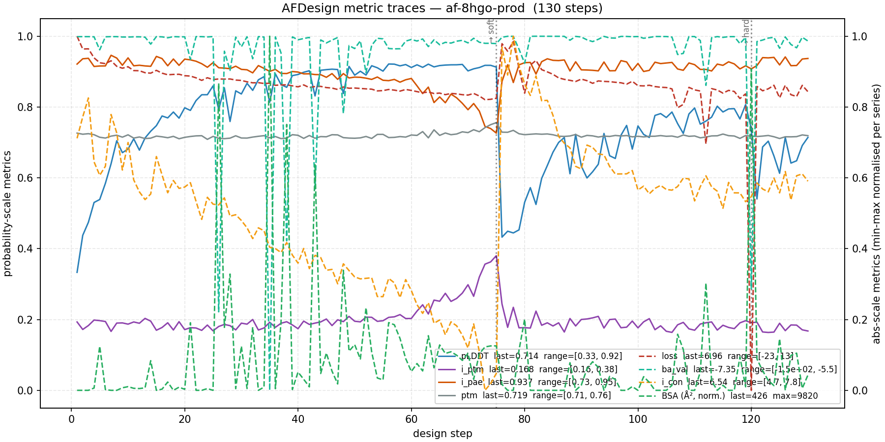

# AFDesign Notes

> **Scope caveat — where validation actually happens.** AFDesign gives you a
> *structural scaffold* for a binder, not a validated binder. In current practice
> (BindCraft, Bennett et al. 2023, RFdiffusion+ProteinMPNN stacks), the design
> pass is followed by two mandatory refinement steps: **(i) ProteinMPNN
> sequence resampling** of the binder onto the designed backbone (Dauparas et al.
> 2022, Science), and **(ii) AlphaFold monomer re-prediction** of the MPNN
> sequences (the "chain trick": fold the binder *alone* with AF2 monomer and
> check the binder Cα RMSD vs. the designed backbone, plus re-fold the complex).
> Only designs that survive this re-prediction filter are ordered. **None of
> that is wired up in this repo yet** — treat `best_sequences` from
> `modal_afdesign_ba_val.py` as optimiser snapshots, not candidates. The
> `ba_val` term (PRODIGY IC-NIS ΔG) is intentionally an **auxiliary smoother
> with a small weight (≤0.3)**; it is not the primary driver and not a
> substitute for MPNN+AF re-prediction. See `References` at the end of this
> document.
>
> **Future work:** hotspot-aware design — a hotspot MSE term (binder centroid
> pulled toward a target-residue centroid) and a contact mask that restricts
> `i_con` to listed hotspot residues — is the highest-leverage addition per the
> current literature (see Bennett et al. 2023 and the Improved RFdiffusion
> 2024 paper). Both are short additions to `add_ba_val_loss(...)` / the Modal
> entrypoint but not in scope for the current pass.

This note explains the stable differentiable helpers that now live in:

- `protein_affinity_gpu.af_design`
- `protein_affinity_gpu.contacts_soft`
- `protein_affinity_gpu.scoring_soft`
- `protein_affinity_gpu.sasa_soft`

The goal is to make the ColabDesign / AfDesign-style `ba_val` loss reusable
from normal Python imports instead of only from benchmark scripts.

## Stable Imports

```python
from protein_affinity_gpu.af_design import add_ba_val_loss
from protein_affinity_gpu.contacts_soft import calculate_residue_contacts_soft
from protein_affinity_gpu.scoring_soft import calculate_nis_percentages_soft
from protein_affinity_gpu.sasa_soft import calculate_sasa_batch_scan_soft
```

These are stable package modules. The old soft-SASA imports from
`protein_affinity_gpu.sasa_experimental` still work as a compatibility layer,
but `sasa_soft.py` is now the source of truth.

## `aux["seq"]["soft"]` vs `aux["seq"]["pseudo"]`

In ColabDesign, both tensors come from the optimized sequence logits, but they
do not mean the same thing:

- `aux["seq"]["soft"]` is the normalized residue-probability simplex.
- `aux["seq"]["pseudo"]` is the tensor ColabDesign feeds into AlphaFold during
  the current design stage.

For sequence-dependent auxiliary losses like `ba_val`, `soft` is usually the
better gradient carrier because it stays on a proper probability simplex and
behaves like an expectation over amino acids.

`pseudo` is still useful when you want the auxiliary loss to mirror the exact
sequence representation AlphaFold saw on the forward pass, even if that makes
the sequence branch less cleanly probabilistic.

The stable `add_ba_val_loss(...)` helper defaults to `binder_seq_mode="soft"`
for that reason.

## `design_logits()` vs `design_soft()`

The choice of design stage changes how the sequence is represented while the
optimizer is updating it:

- `design_logits()` optimizes the raw latent sequence parameters.
- `design_soft()` optimizes a softmaxed sequence distribution directly.

From a deep-learning perspective:

- `design_logits()` tends to commit faster and can produce sharper updates.
- `design_soft()` tends to keep more entropy in the sequence distribution,
  which makes the optimization landscape smoother and exploration longer.

This means a `soft` run often collapses more slowly to a single sequence, while
the logits run often makes harder sequence commitments earlier.

## Hard vs Soft Contacts

The hard contact kernel asks a binary question: is any valid atom pair within
the cutoff distance?

The soft contact kernel replaces that with a sigmoid around the cutoff and then
aggregates atom-pair probabilities into a residue-residue contact probability:

- hard contacts: exact inference-style decision
- soft contacts: differentiable probability in `[0, 1]`

As `beta -> infinity`, the soft contact kernel approaches the hard decision.

## Hard vs Soft NIS Thresholding

The hard NIS step uses a binary exposure gate:

- exposed if `relative_sasa >= threshold`
- buried otherwise

The soft NIS version replaces that step with a sigmoid around the threshold.
That keeps the NIS percentages differentiable with respect to SASA and, through
SASA, with respect to coordinates and sequence probabilities.

Again, increasing `beta` makes the soft gate behave more like the hard one.

## Hard vs Soft SASA

The hard Shrake–Rupley buried-point test is discrete:

- a sphere point is buried if it falls inside an occluding atom
- otherwise it is accessible

The soft SASA kernel replaces that buried-point decision with a sigmoid-smoothed
occlusion probability and accumulates accessibility in log-space for numerical
stability.

Why this matters:

- hard SASA is great for inference parity
- soft SASA gives non-zero gradients through the buried-point test

That makes the soft kernel suitable for backpropagation-based design losses.

## Why Soft Functions Backpropagate

The stable soft helpers are built out of standard JAX operations such as:

- `jax.nn.sigmoid`
- `jax.nn.softplus`
- matrix multiplication
- sums, products, concatenations, and exponentials

When those helpers are used inside ColabDesign's loss callback, their outputs
become part of the scalar loss that ColabDesign passes into `jax.value_and_grad`.
That is what gives you usable gradients.

The important contrast is:

- hard threshold / hard `any` / hard exposure gates produce sparse or zero
  gradient almost everywhere
- soft sigmoids and softplus produce smooth local gradients that the optimizer
  can actually follow

## What `ba_val` Actually Optimizes

The `ba_val` callback does not optimize `beta` directly. Instead, it computes a
scalar binding-energy proxy `dg` from the current AlphaFold structure and the
current binder sequence representation, and that scalar becomes one term in the
full AfDesign objective.

The path is:

```text
sequence logits
-> binder sequence probabilities / pseudo-sequence
-> target-binder contacts
-> complex SASA
-> relative SASA
-> NIS percentages
-> PRODIGY IC-NIS linear score (dg)
-> weighted total loss
```

More concretely:

- contacts are grouped into PRODIGY interaction classes
- SASA is computed on the whole complex and converted to relative SASA
- NIS percentages are derived from the relative SASA values
- those six features are fed into the PRODIGY linear model

The final `dg` term is:

```text
dg =
  -0.09459 * IC_CC
  -0.10007 * IC_CA
  +0.19577 * IC_PP
  -0.22671 * IC_PA
  +0.18681 * P_NIS_A
  +0.13810 * P_NIS_C
  -15.9433
```

where:

- `IC_CC` = charged-charged interface contacts
- `IC_CA` = charged-apolar interface contacts
- `IC_PP` = polar-polar interface contacts
- `IC_PA` = polar-apolar interface contacts
- `P_NIS_A` = percent apolar non-interacting surface
- `P_NIS_C` = percent charged non-interacting surface

In the Modal benchmark, this is then weighted as one part of the full design
loss:

```text
total_loss = other_afdesign_terms + ba_val_weight * dg
```

So with a positive `ba_val_weight`, the optimizer is pushed toward structures
and sequences that make the predicted `dg` more favorable under the PRODIGY
IC-NIS model.

## What `beta` Does and Does Not Do

The `beta` parameters in the soft helpers are fixed hyperparameters. They are
not learned model parameters in the current implementation.

What `beta` does:

- controls how sharp the soft contact switch is
- controls how sharp the soft SASA buried-point decision is
- controls how sharp the soft NIS exposure threshold is
- changes the size and locality of the gradient near each decision boundary

What `beta` does not do:

- it is not optimized by backpropagation in `add_ba_val_loss(...)`
- it is not part of the final PRODIGY linear score by itself
- it does not change what features the loss uses, only how smoothly those
  features are computed

So the clean mental model is:

- `dg` is the objective term being minimized
- `beta` shapes the differentiable path used to compute `dg`

## What Changes Theoretically During Optimization

If you compare a soft-design run against a more non-soft run, the main ML/DL
differences are:

- smoother gradient field: nearby sequences get related gradients instead of a
  mostly discrete signal
- slower collapse: the sequence distribution keeps entropy longer
- higher exploration: optimization can move by reweighting amino-acid
  probabilities before committing
- expectation-style scoring: the loss reflects mixtures over residues rather
  than only one hard sequence
- train / inference mismatch risk: once you discretize the final sequence, the
  hard sequence can behave a bit differently from the soft expectation that was
  optimized

In practice this usually means:

- soft losses are easier to optimize
- hard losses are closer to the final discretized design objective
- mixing the two is often useful, with soft terms early and harder terms later

## Practical Default

For AfDesign-style `ba_val` optimization, the recommended default is:

- `binder_seq_mode="soft"`
- `use_soft_contacts=True`
- `use_soft_nis=True`
- soft SASA enabled through `protein_affinity_gpu.sasa_soft`

That gives the cleanest differentiable path while keeping the underlying
PRODIGY-style score structure intact.

### Diagnostic: buried surface area (BSA)

Alongside the loss-side metrics, `af_design/modal_afdesign_ba_val.py`
logs per-iteration buried surface area to `bsa_history.json`:

```text
BSA = SASA(target_alone) + SASA(binder_alone) − SASA(complex)
```

This runs in a post-step callback using the **hard** SASA kernel
(`calculate_sasa_batch_scan`) on `aux["atom_positions"]`, so it adds
zero backprop cost and does not alter the loss. BSA is a direct
interface-formation readout — a converging trajectory should trend
upward into the ~200–1500 Ų range typical of natural protein-protein
interfaces. Plot it with `af_design/plot_afdesign.py rmsd --metric bsa`
(or `--metric both` for the RMSD + BSA two-panel).

### Stage 1 runs with `ba_val` zeroed

In the three-stage cascade, `ba_val` (PRODIGY IC-NIS ΔG) is zero-weighted
during `design_logits` and only restored for `design_soft` +
`design_hard`:

- stage 1 (`design_logits`, 75 iters) — `weights["ba_val"] = 0.0`
- stage 2 (`design_soft`, 45 iters) — `weights["ba_val"] = ba_val_weight`
- stage 3 (`design_hard`, 10 iters) — inherits stage 2 weights

Why: before the binder has actually folded and placed into contact,
PRODIGY's IC-NIS score collapses to the constant −15.94 intercept plus
regression-coefficient noise over ~zero contacts. Its gradient in that
regime is just noise, and it eats optimiser budget that the AF-native
structural terms (pLDDT, pAE, contacts, rg) could use to find the
interface. Once stage 2 starts, the binder has a fold and an
approximate placement, so the PRODIGY ΔG gradient starts carrying real
binding-affinity signal.

Consequence: the raw `loss` scalar across stages is not directly
comparable — stage 1 minimises a purely structural objective, stage 2+
adds the ΔG term. Compare runs by per-metric values (`i_ptm`, `i_con`,
`ba_val`, BSA), not by `loss`.

BSA logging stays on for all stages — it is a diagnostic, not a loss,
so zero-contact frames correctly log BSA ≈ 0 and do not distort the
objective. A per-step `i_con` gate that skips the hard-SASA calls when
no contacts exist is a cheap future optimisation, not required.

## April 2026 run notes

### SASA instability in production traces (still investigating)

Production three-stage runs on 8HGO (EGFR/HER2, binder=200 aa, 75+45+10 iters)
show that the `ba_val` term and the diagnostic BSA both go through a noisy
regime around the logits→soft transition. The `af-8hgo-prod` metric traces
(copied below from `benchmarks/output/afdesign_april2026/af-8hgo-prod/`) are
representative:



What the plot shows:

- `ba_val` range spans `[-1.5e+02, -5.5]` across the run — the Prodigy-IC score
  oscillates heavily while the binder is still placing itself against the
  target, even though the regression is supposed to be bounded.
- BSA peaks at `~9820 Ų` mid-run before settling near `~425 Ų` at the end.
  Natural protein-protein interfaces are in the `200–1500 Ų` band, so the
  spike is a compute artefact (hard-SASA kernel instability when the binder
  and target overlap numerically, not a real interface formation event).
- The `i_ptm` / `i_pae` / `plddt` probability-scale curves are comparatively
  well-behaved.

Current working theory: during the logits stage the binder has not yet
committed to a fold or a target-facing orientation, and the hard Shrake–Rupley
kernel reads whatever inter-chain coordinates happen to exist. The soft-SASA
path used *inside* the gradient (via `add_ba_val_loss`) smooths this out, but
the hard-SASA diagnostic does not. Mitigations tried so far:

- **Gated compute** — BSA is now only evaluated when
  `weights["ba_val"] > 0`, so the logits-stage zero-weighted frames no longer
  produce spurious BSA entries (`bsa_history.json` writes `NaN` instead).
  The plot masks these out.
- **Stage-schedule gating** — the `ba_val` loss itself is zero-weighted during
  stage 1; the spikes are therefore a *diagnostic* artefact and do not steer
  the optimiser.

Still open:

- Hard-SASA kernel behaviour when the binder passes through the target volume
  numerically (i.e. before stage 2 places a real interface). A contact-count
  pre-gate on the hard-SASA calls, or a soft-SASA replacement for the BSA
  diagnostic, would both remove the artefact.
- Whether the early-stage ba_val oscillation is entirely a SASA artefact or
  whether the contact-class counts (IC_CC / IC_CA / IC_PP / IC_PA) are also
  unstable. The PRODIGY regression is linear so a noisy contact count
  translates directly into a noisy ΔG.

### Adaptive stage schedule (Phase A / Phase B)

An adaptive alternative to the fixed three-stage cascade is now wired up:

- **Phase A** — `design_soft` with `weights["ba_val"] = 0`, runs until `i_ptm`
  stops improving (min_delta / patience / stability-window early-stop).
- **Phase B** — `design_soft` with `weights["ba_val"] = ba_val_weight`, runs
  for the remainder of the soft-stage budget.
- **Hard stage** — `design_hard` unchanged.

Motivation: fixed 75+45+10 wastes compute when the target happens to lock in
i_ptm in the first ~20 steps, and under-runs when it doesn't. The adaptive
path lets Phase A collect a structural scaffold under a clean
(AF-native-only) loss before the PRODIGY ΔG term joins the objective.

### Infrastructure notes

- **BSA compute gate.** Previously the three hard-SASA kernel calls
  (`target_alone`, `binder_alone`, `complex`) ran every step regardless of
  `ba_val` weight. Grepping `jax.sasa.scan` in the old Modal log showed 878
  calls across 146 steps; after gating, a full run logs only the single
  compile-banner line.
- **Early-stop bug.** `_latest_metric(...)` used to read from
  `af_model.aux["log"]`, which fires *before* ColabDesign's
  `_save_results` finalises the per-step log. Adaptive runs were therefore
  gating on stale values and never early-stopping. Fixed by reading
  `af_model._tmp["log"][-1]` — the same list that becomes `trajectory.json`,
  guaranteed finalised at callback time.
- **Modal `--detach`.** Long runs (multi-hundred-step cascades, ~30+ min on
  A100-80GB) must be launched with `modal run --detach`; otherwise the local
  CLI owns the app heartbeat and any disconnect (abort, network blip, laptop
  sleep) kills the app mid-run with `APP_STATE_STOPPED`.
- **Per-step diagnostic logging.** Both Phase A and Phase B loops now emit
  `[phase_a] step=… cur_iptm=… a_best=… a_best_iter=… gap=… streak=…` so
  early-stop decisions are inspectable from the Modal log without re-running.
- **Hotspot extraction helper.** `af_design/extract_interface_hotspots.py`
  prints an AFDesign-ready `--hotspot` string (e.g. `"A42,A45,A89"`) for any
  two chains in a PDB, with an optional `--top-k` for the N closest residues.
  Used to seed the EGFR/HER2 runs with the 6 tightest-contact residues.

### Output layout

AFDesign April 2026 runs are grouped under
`benchmarks/output/afdesign_april2026/` (ten run directories plus the four
comparison PNGs and the per-run Modal logs under `logs/`). The earlier
flat layout under `benchmarks/output/` is no longer used for new runs.

## TODO

### Isolate initialization from optimizer in "soft vs hard" comparisons

`af_design/modal_afdesign_ba_val.py` currently calls:

```python
af_model.restart(seed=seed, mode=["gumbel", "soft"], reset_opt=False)
```

independently of `design_mode`. So the "soft" and "hard-ish" runs share:

- the same seed
- the same initial logits (gumbel-sampled, passed through softmax)

and only differ in:

- the optimizer step (`design_soft` vs `design_logits`)
- `binder_seq_mode` (soft probabilities vs straight-through pseudo-sequence)
- `use_soft_contacts` / `use_soft_nis`

SASA stays soft in both because `add_ba_val_loss(...)` always uses
`calculate_sasa_batch_scan_soft(...)` internally.

This means the current "soft vs hard-ish" A/B is really measuring the effect of
the optimizer and the contact/NIS softness, not a clean hard/soft SASA split.
Two follow-ups worth doing:

1. Expose a `use_soft_sasa` toggle in `add_ba_val_loss(...)` and wire it up in
   the Modal entrypoint, so a true hard-SASA baseline is reachable. BSA is
   already logged independently via the post-step callback and does not
   depend on this toggle.
2. Consider varying the `restart(mode=...)` initialization to match the design
   mode (e.g. a pure-gumbel or one-hot init for `design_logits` runs) if we
   want to isolate "optimizer shape" from "init shape".

Until (1) lands, runs from `modal_afdesign_ba_val.py` with
`use_soft_contacts=false` and `use_soft_nis=false` should be reported as
"hard-ish" rather than a true hard baseline.

## References

- Dauparas, J. et al. **Robust deep learning–based protein sequence design
  using ProteinMPNN.** *Science* 378, 49–56 (2022).
  https://www.science.org/doi/10.1126/science.add2187
- Bennett, N. R. et al. **Improving de novo protein binder design with deep
  learning.** *Nature Communications* 14, 2625 (2023).
  https://www.nature.com/articles/s41467-023-38328-5
- Pacesa, M. et al. **BindCraft: one-shot design of functional protein
  binders.** *Nature* (2025). https://www.nature.com/articles/s41586-025-09429-6
- Watson, J. L. et al. **De novo design of protein structure and function with
  RFdiffusion.** *Nature* 620, 1089–1100 (2023).
  https://www.nature.com/articles/s41586-023-06415-8
- **ColabDesign / AFDesign.** https://github.com/sokrypton/ColabDesign
- **ipSAE (Dunbrack interface score).**
  https://levitate.bio/fixing-the-flaws-in-alphafolds-interface-scoring-meet-dunbracks-ipsae/
- Full research notes for this pipeline:
  `claudedocs/research_binder_design_20260422-135154.md`.
